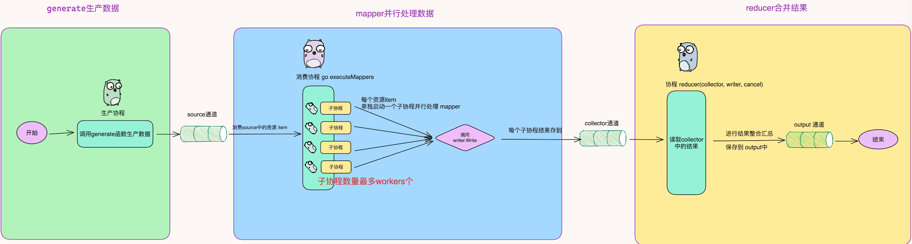

# Golang实现并行计算

代码地址:

### 为什么需要 `MapReduce`
在实际的业务场景中我们常常需要从不同的 rpc 服务中获取相应属性来组装成复杂对象。
比如要查询商品详情：

商品服务-查询商品属性
库存服务-查询库存属性
价格服务-查询价格属性
营销服务-查询营销属性

如果是串行调用的话响应时间会随着 rpc 调用次数呈线性增长，所以我们要优化性能一般会将串行改并行。
简单的场景下使用 waitGroup 也能够满足需求，但是如果我们需要对数据进行校验、数据加工转换、数据汇总呢？继续使用 waitGroup 就有点力不从心了。


场景一：从多个服务获取产品数据

```go
func productDetail(uid, pid int64) (*ProductDetail, error) {
	var pd ProductDetail
	err := mr.Finish(func() (err error) {
		pd.User, err = userRpc.User(uid)
		return
	}, func() (err error) {
		pd.Store, err = storeRpc.Store(pid)
		return
	}, func() (err error) {
		pd.Order, err = orderRpc.Order(pid)
		return
	})

	if err != nil {
		log.Printf("product detail error: %v", err)
		return nil, err
	}

	return &pd, nil
}
```

场景二：有一批uids数据需要进行清洗

```go
func TestMapReduce(t *testing.T) {

	uids := []int64{1, 2, 3, 4, 5, 6, 79}
	r, err := MapReduce(func(source chan<- interface{}) {
		for _, uid := range uids {
			source <- uid
		}
	}, func(item interface{}, writer Writer, cancel func(error)) {
		uid := item.(int64)
		ok, err := check(uid)
		if err != nil {
			cancel(err)
		}
		if ok {
			writer.Write(uid)
		}
	}, func(pipe <-chan interface{}, writer Writer, cancel func(error)) {
		var uids []int64
		for p := range pipe {
			uids = append(uids, p.(int64))
		}
		writer.Write(uids)
	})

	assert.Nil(t, err)
	assert.Equal(t, []int64{79}, r)

}

func check(uid int64) (bool, error) {
	// do something check user legal
	if uid > 6 {
		return true, nil
	}
	return false, nil
}
```

### MapReduce代码架构 


`generate`对应代码中的`buildSource`函数逻辑
`mapper`对应代码中的`executeMappers`函数逻辑
`reducer`对应代码中的`go func() {... reducer(collector, writer, cancel) ...}`逻辑



### 代码解读

这里以 `func MapReduce(generate GenerateFunc, mapper MapperFunc, reducer ReducerFunc, opts ...Option) (interface{}, error)`方法为例讲解：


- `generate GenerateFunc` 用户实现的生成数据函数
- `mapper MapperFunc` 用户实现的处理数据函数
- `reducer ReducerFunc` 用户实现的数据汇总函数
- `opts ...Option`基本配置项（用来配置处理协程的数量）

```go
// MapReduce 从source中读取数据，通过mapper并发处理后，将中间结果保存到collector中，并通过reducer函数对中间结果进行汇总，返回
func MapReduce(generate GenerateFunc, mapper MapperFunc, reducer ReducerFunc, opts ...Option) (interface{}, error) {
	// 创建source通道
	source := buildSource(generate)
	// 核心处理方法
	return MapReduceWithSource(source, mapper, reducer, opts...)
}

```


#### buildSource 函数

- `buildSource` 创建 `source`通道，并在协程中调用`generate`函数，在`generate`函数中，会将数据写入到`source`中；
- 最后在`defer`中关闭 `source`表示数据全部发送完成

```go
func buildSource(generate GenerateFunc) chan interface{} {
	source := make(chan interface{})

	// 启动协程，调用generate函数生产数据到 source通道中
	threading.GoSafe(func() {
		// generate函数执行完毕后，关闭source
		defer close(source)
		// generate内部，负责将数据写入到source中
		generate(source)
	})

	return source
}

```

#### MapReduceWithSource 函数
建议参考上面的图进行理解

- 创建 `output := make(chan interface{})`通道，用来存储汇总后的最终结果
- 创建 `collector := make(chan interface{}, options.workers)`通道，用来存储 `mapper`加工后的中间结果
- 启动协程`go func(){ reducer(collector, writer, cancel) }` 目的在于监听 `collector`通道,汇总结果保存到`output`通道中(协程的正常退出，需要collector的关闭)
- 启动协程 `go executeMappers` 目的在于监听`source`通道,将加工的中间结果保存到`collector`通道中；
- 最后一直阻塞在`output`通道处，等待最终的结果的输出

```go

func MapReduceWithSource(source <-chan interface{}, mapper MapperFunc, reducer ReducerFunc, opts ...Option) (interface{}, error) {

	// 1.配置协程数
	options := buildOptions(opts...)
	// 2.输出结果
	output := make(chan interface{})

	defer func() {
		// 限定输出结果只能有一个，不能往output中多次写入
		for range output {
			panic("more than one element written in reducer")
		}
	}()

	// 3.mapper处理的中间结果，存储collector通道中
	collector := make(chan interface{}, options.workers)

	done := syncx.NewDoneChan() // 理解为：用通道作为关闭标识

	writer := newGuardedWriter(output, done.Done()) // writer就是指代的output通道

	var closeOnce sync.Once // 目的：在finish中只执行一次关闭
	var retErr error

	finish := func() {

		closeOnce.Do(func() {
			done.Close()  //理解为：打开了关闭标识
			close(output) // 关闭output可以避免，如果没有向output中写入数据，output最后不会阻塞
		})
	}

	cancel := once(func(err error) { // 取消操作
		// 设置错误信息
		if err != nil {
			retErr = err
		} else {
			retErr = ErrCancelWithNil
		}
		drain(source) //一旦取消，source中的数据就不会被消费，那么生产协程就会一直阻塞中（避免内存泄漏，让生产协程能正常退出）
		finish()
	})

	// 4. 本协程的目的就是从collector通道中读取数据，在reducer函数中进行最后的汇总后，写入到writer中（即：output)
	go func() {
		defer func() {
			// drain函数：如果collector不关闭，等待
			drain(collector) // （这里也是防御编程，避免在reducer中忘记读取collector数据）
			if r := recover(); r != nil {
				cancel(fmt.Errorf("%v", r))
			} else {
				finish()
			}
		}()
		// writer就是指代的output通道
		reducer(collector, writer, cancel)
	}()

	// 5. 从source中读取数据，并启动最多workers个子协程并行处理，处理后到结果保存到collector中
	go executeMappers(func(item interface{}, w Writer) {
		// item就是从source中获取的数据
		// w 指代的是collector
		mapper(item, w, cancel)
	}, source, collector, done.Done(), options.workers)

	// 这里是阻塞中（解除阻塞条件：要么关闭output，要么向output写入数据）
	value, ok := <-output
	if err := retErr; err != nil {
		return nil, err
	} else if ok {
		return value, nil
	} else {
		return nil, ErrReduceNoOutput
	}
}

```


#### drain 函数

`drain`函数的目的是让阻塞在`channel`上的协程，能正常的退出

```go
// drain 函数有两种含义：
// 1.一直阻塞直到 channel关闭
// 2.不断的读取channel中的数据，让写入端可以一直写入（直到没有新数据写入）
func drain(channel <-chan interface{}) {
	for range channel {
	}
}

```

请参考这里的代码，理解`drain`函数

```go
func TestDrain(t *testing.T) {

	ch := make(chan interface{})
	// 启动3个协程
	for i := 0; i < 3; i++ {
		go func(val int) {
			ch <- val
			fmt.Println(val)
		}(i)
	}
	// 如果不调用drain，ch就一直不被读取，那么上面的3个协程就一直阻塞在ch上，无法退出（造成内存泄漏）
	drain(ch)
}

```


#### executeMappers 函数

开启`for`死循环，一直从`input`中读取数据`item`，并行开启多个协程调用`mapper`函数处理，并将结果保存到 `collector` 中;
这里的`input`就是`source`;
当处理完成`source`中的数据后，需要将`close(collector)`，因为 `reducer`在一直监视着`collector`通道，不关闭的话，`reducer`就无法终止（因为`drain(collector)`函数）

```go
// executeMappers 从input中读取数据item，并行开启多个协程处理，并将结果保存到 collector 中
func executeMappers(mapper MapFunc, input <-chan interface{}, collector chan<- interface{},
	done <-chan PlaceholderType, workers int) {

	var wg sync.WaitGroup

	// 只有source or done 关闭了，defer才会执行
	defer func() {
		wg.Wait()        // 等协程处理完数据
		close(collector) // 关闭collector，reducer协程才会退出
	}()

	// 目的：限定启动的协程的最大数量
	pool := make(chan PlaceholderType, workers)

	// 这里的writer指代的是collector
	writer := newGuardedWriter(collector, done)

	// 这里是一个死循环，负责消费source中的数据（和buildSource函数呼应）
	for {
		select {
		case <-done: // done关闭
			return
		case pool <- Placeholder: // 最多启动 workers个协程处理
			item, ok := <-input
			if !ok { //source被关闭（buildSource函数中，发送完数据后会关闭source）
				<-pool
				return
			}
			wg.Add(1)

			// 协程
			threading.GoSafe(func() {
				defer func() {
					wg.Done()
					<-pool
				}()
				// source中的item数据，处理完成的结果保存到 collector中
				mapper(item, writer)
			})
		}
	}
}

```